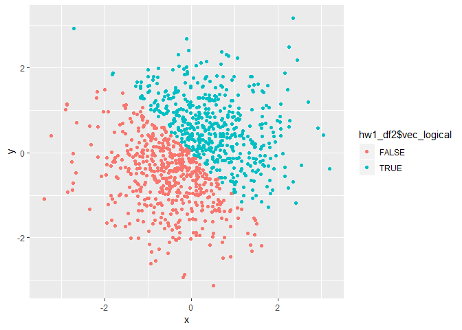
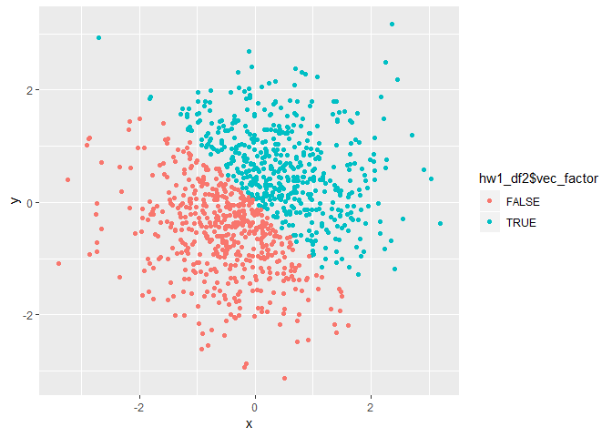
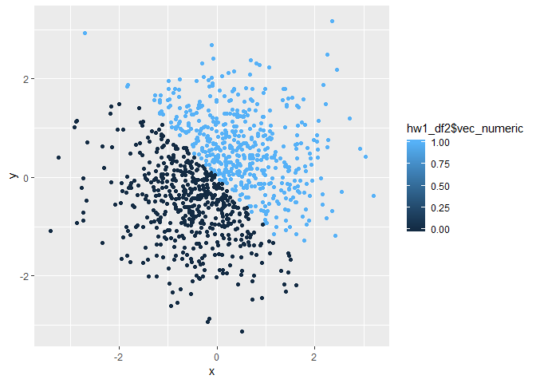

p8105\_hw1\_pc2853
================
pc2853
September 21, 2018

Problem 1
=========

### Below is the dataset comprised of a numerical vector, a logical vector, a character vector and a factor vector, with the mean of each vector shown.

``` r
hw1_df = tibble(
 vec_numeric = runif(10, min = 0, max = 5),
 vec_logical = c(vec_numeric > 2),
 vec_char = c("My", "Name", "Is", "Pengxuan", "Chen", "Thisis", "My", "First", "Homework", "Assignment"),
 vec_factor = factor(c("coke", "pepsi", "coke", "coke", "pepsi", "coke", "coke", "coke", "coke", "coke")),
)


mean(hw1_df$vec_numeric)
```

    ## [1] 3.03851

``` r
mean(hw1_df$vec_logical)
```

    ## [1] 0.8

``` r
mean(hw1_df$vec_char)
```

    ## Warning in mean.default(hw1_df$vec_char): argument is not numeric or
    ## logical: returning NA

    ## [1] NA

``` r
mean(hw1_df$vec_factor)
```

    ## Warning in mean.default(hw1_df$vec_factor): argument is not numeric or
    ## logical: returning NA

    ## [1] NA

### Here is the code converting the type of vectors into another without showing the results.

``` r
as.numeric(hw1_df$vec_logical)
as.numeric(hw1_df$vec_char)
as.numeric(hw1_df$vec_factor)
```

``` r
as.numeric(as.factor(hw1_df$vec_char))
as.numeric(as.character(hw1_df$vec_factor))
```

------------------------------------------------------------------------

Problem 2
=========

``` r
set.seed(1234)

hw1_df2 = tibble(
  x = rnorm(1000),
  y = rnorm(1000),
  vec_logical = c((x + y) > 0),
  vec_numeric = as.numeric(vec_logical),
  vec_factor = as.factor(vec_logical)
)
```

### Here is a data frame comprised of 2 random samples x and y from standard normal distribution, and a logical vector, numerical vector and a factor vector.

-   The size of the dataset is 1000
-   The mean of the dataset is -0.0265972
-   The median of the dataset is -0.0265972
-   The proportion of cases for which the logical vector is TRUE, is 498

### Below are the scatterplots of y vs x which are colored by using logical, numerical and factor vectors separately.

``` r
ggplot(hw1_df2, aes(x=x, y=y, color = hw1_df2$vec_logical)) + geom_point()
```



``` r
ggsave("scatter_plot.pdf", height = 4, width = 6)

ggplot(hw1_df2, aes(x=x, y=y, color = hw1_df2$vec_factor)) + geom_point()
```



``` r
ggplot(hw1_df2, aes(x=x, y=y, color = hw1_df2$vec_numeric)) + geom_point()
```


